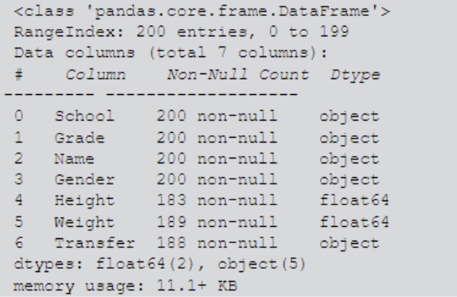
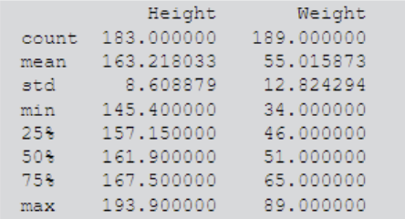

# pandas基础

## 1.1 NumPy基础

### 1.1 NumPy数组构造

```
import numpy as np
np.array([1,2,3)
```

1. 等差数列

生成数值均匀间隔数组的函数为np.linspace()和np.arrange()， 前者三个参数代表起始点、终止点（包含）与样本个数，后者的三个参数代表的起始点、终止点（不包含）与步长

np.linspace(1,5,5)

array([1.,2.,3.,4.,5.])

np.arrange(1,5,1)

array([1,2,3,4])

2. 特殊矩阵

np.zeros(), np.ones(), np.eye(), np.full()

np.zeros() 和np.ones()传入的是元组，数组每一个维度的大小

np.zeros((2,3,4)) #中外层二维， 中层三维，内层四维

array([[[0.,0.,0.,0.,],

[0.,0.,0.,0.],

[0.,0.,0.,0.]],

[[0.,0.,0.,0.,],

[0.,0.,0.,0.,],

[0.,0.,0.,0.,]]])

全零函数np.zeros()是填充函数np.full()的特例，后者是再第一个参数中传入元组表示维数，在第二个参数中传入单个数值代表填充元素

np.full((2,3),10)

array([[10,10,10],

[10,10,10]])

生成和给定数组相同大小的全零矩阵....使用np.zeros_like()np.ones_like()

arr = [[1,2], [3,4]]

np.zeros_like(arr)

array([[0,0],

[0,0]])

单位矩阵 np.eye()

np.eye(3)

array([[1.,0.,0.],

[0.,1.,0.],

[0.,0.,1.]])

k表示偏移距离，k>=1向上偏移

np.eye(3,k=1)

array([[0.,1.,0.],

[0.,0.,1.],

[0.,0.,0.]])

3. 随机数组

uniform() -- 均匀分布

normal() -- 正态分布

randint() --- 随机整体数组

 和 choice() --- 随机列表抽样

uniform(a,b,size) U[a,b] 且数组维度为size的均匀分布的数组

## 第二章 pandas基础

### 2.1基础

#### 2.1 .1文件的读取和写入

df_csv = pd.read_csv('data/ch2/my_csv.csv')

df_txt = pd.read_table('dara/ch2/my_table.txt')

df_excel = pd.read_excel('data/ch2/my_excel.xlsx')

index_col = {'col1', 'col2'}

#### 2.1.2 数据写入

去掉数据索引：index = False

```python
print(df_csv.style.to_latex())
print(df_csv.to_markdown())
```

### 2.2.基本数据结构

1.values的series 2.存储二维值属性values的dataframe

#### 2.2.1series

四个重要组成部分，序列的data，index，dtype（存储类型）和序列的名字name

```python
s = pd.Series(data = []),
	index = pd.index（），
	dtype = ''; #int,float,string,category
	name = '')
```

object 代表一个混合类型，pandas把纯字符串序列当作一种object类型的序列，也可以作为string

```python
s.values
s.index
s.dtype
s.name
s.shape // 序列的长度
s['third']
```

#### 2.2.2 datafram

在series上增加了列索引，可以由二维的data与行列索引来构造

```python
data = [{1,'a', 1.2] , [2,'b',2.2] , [3,'c', 3,2]}
df = pd.DataFrame(data=data,
	index = ['row_%d' %i for i in rang(3),  #row索引
	column = ['col_0', 'col_1,'col_2']) #column index  
df
```

更多时候采用列索引名刀数据的映射来构造dataframe，再加上行索引

用[col_name]与[col_list]来取出相应的列与由多个列组成新的dataframe，结果分别为series 和 dataframe

```python
df['col_0]
row_0 1
row_1 2
row_2 3
Name: col_0, dtype:int 64
```

```python
df['col_0', 'col_1']
	col_0   rol_1
row_0 1   	a
row_1 2	 	b
row_2 3 	c
```

使用to_frame() 可以把序列转换为列数为1的dataframe

.T 行列转置

df[col_name] 修改或者新增一列

删除一列用drop

axis = 1删除列，axis = 0 删除行

### 2.3常用基本函数

#### 2.3.1 汇总函数

df.head() --- 前n行

df.tail() --- 后n行

df.info() ---- 表的信息概况



df.describe()  ----- 表中数值列对应的主要统计量



初步汇总

#### 2.3.2 特征统计函数
